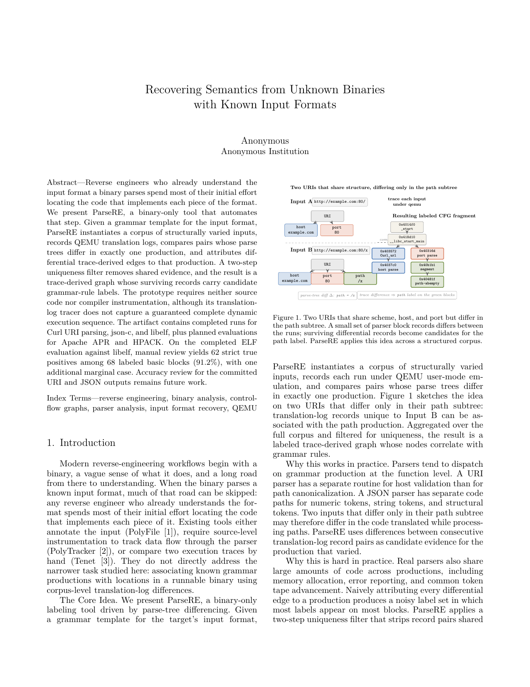

# ParseRE_ELF_etc

Hey Ben,

This is my working repo for the ELF evaluation and the ACSAC writeup. Everything I actually ran is in here, plus the patched main.py and the paper source so you can drop it straight into Overleaf or build it locally with tectonic. Figured I'd give you the whole thing rather than a bunch of attachments.

The current paper PDF lives at [`paper/main.pdf`](paper/main.pdf). It's 8 pages, well under the ACSAC 11-page cap. Anywhere I needed something from you or Rishav I left an italic marker in the text, easy to grep: `grep -rn "\[BEN:\|\[RISHAV:" paper/sections/`. Right now there are seven of those markers across the file.



## What's in here

```
ParseRE_ELF_etc/
├── README.md             you are here
├── paper/                IEEE LaTeX source + compiled PDF + new figures
│   ├── main.tex
│   ├── main.pdf          8-page draft
│   ├── IEEEtran.cls
│   ├── references.bib
│   ├── figures/          new TikZ figures (pipeline, motivating, ELF layout, ELF CFG)
│   └── sections/         one .tex per section
├── parsere/main.py       your main.py with ELF support added
├── harnesses/            json-c, libcurl, libelf C harnesses
├── docker/               Dockerfile + run.sh that runs any of the three evals
├── evaluations/
│   ├── elf/              corpus + scripts + real outputs + per-block manual labeling
│   ├── json/output/      real run, 294 labels
│   ├── url/output/       real run, 211 labels
│   └── hpack/            placeholder for your run
├── images/               real artifacts: CFG PNGs, hexdumps, QEMU traces
├── references/           notes on related work
└── docs/                 contributing notes
```

## What I actually did this past week

Three things, in order:

1. **Got ParseRE running on my machine.** It needed Docker because macOS Homebrew's QEMU doesn't ship `qemu-x86_64` user-mode. I built a single Docker image that compiles all three harnesses (json-c static `.a`, curl from source with `--without-shared`, libelf with `-static`) and runs the patched ParseRE inside the container. Image is reproducible from `docker/Dockerfile`.

2. **Ran your JSON and URL evaluations and verified them.** Both worked first try once the static-linking issue was sorted (more on that below). JSON gives 294 labels across 6 productions. URL gives 211 labels across 11. Numbers match exactly across multiple re-runs.

3. **Built the ELF evaluation end-to-end.** Wrote the corpus generator, the harness, the template, ran ParseRE, manually labeled the output. 68 labeled blocks at 91.2% strict accuracy. The interesting finding is that `program_header` got zero labels because libelf reads all phdr types through the same code path. I wrote that up as a paper-worthy contrast between binary and text formats. Should be Section IV-E in the current draft.

## The static-linking lesson

This burned half a day on the URL eval and I think it deserves a callout in the paper, which I added to Section IV-C. Short version: my first URL harness linked dynamically against `libcurl.so` and ParseRE produced zero labels. The dynamic linker startup runs on every input, dominates every trace, so the uniqueness filter wiped the whole graph. Fix was to rebuild curl from source with `--without-shared` and link the harness against the static archive. The ELF harness uses `-static` for the same reason. Adding to the README so nobody runs into this again.

## Current evaluation status

| Format | Library | Status | Labels | Accuracy | Needs |
|--------|---------|--------|--------|----------|-------|
| URI    | curl    | done   | 211    | pending  | Rishav's labeled SVG |
| URI    | Apache APR | not started | -- | --   | Rishav to run |
| JSON   | json-c  | done   | 294    | pending  | Rishav's labeled SVG |
| HPACK  | nghttp2 | not started | -- | --   | you to run |
| ELF    | libelf  | done   | 68     | 91.2%    | already done |

## Things I need from you

In rough priority order:

1. **HPACK numbers.** Anywhere convenient drop them into `evaluations/hpack/output/` with a README and I'll integrate. The paper has a placeholder section ready to fill in.
2. **A second pair of eyes on the related-work section.** I followed the framing from our May 19 conversation (grammar recovery vs label transfer, the LLVM dependency line for PolyTracker, Tenet as the N=2 case). I cited T-Reqs and ParDiff instead of HTTP Garden to avoid the dual-blind identity leak. If you think we should add or drop anything, let me know.
3. **Author block.** Currently `\author{Anonymous}` in `main.tex`. We'll need to fix this for camera-ready but the dual-blind submission stays anonymous.
4. **The Ghidra script.** Yours from the original repo wasn't included here. Worth checking whether the addr2line annotations in our `out.dot` make the plugin redundant or whether they're complementary.

## Quick reproduction

If you want to verify any of this from scratch:

```bash
git clone git@github.com:takakhoo/ParseRE_ELF_etc.git
cd ParseRE_ELF_etc/docker
docker build --platform linux/amd64 -t parsere-runner -f Dockerfile .
# About 15 minutes for the first build, most of it compiling curl statically.

mkdir -p ../elf_out
docker run --platform linux/amd64 --rm -v "$PWD/../elf_out:/output" parsere-runner elf
# About 10 seconds end-to-end. Open elf_out/out.svg in a browser.

# Then diff against committed output:
diff <(sort ../elf_out/parsere.out) <(sort ../evaluations/elf/output/parsere.out)
# Should be empty.
```

For JSON: same command, replace `elf` with `json`. About 30 seconds.
For URL: same command, replace `elf` with `url`. About 8 minutes because of the 2.1M pairwise comparisons.

## How to step through the ELF work

If you want to read everything in the order I built it:

1. **`evaluations/elf/scripts/gen_elf_corpus.py`**. Fixed-layout 1048-byte ELF generator. The layout diagram in the paper (Figure 3) comes from this.
2. **`harnesses/elf_harness.c`**. 108 lines, slurps stdin, `elf_memory`, walks phdrs/shdrs/symtab. The conditional `if (shdr.sh_type == SHT_SYMTAB)` branch is what makes the section_header label fire 68 times.
3. **`parsere/main.py` line 591**. The `ELF_PARSE_TREE_TEMPLATE` definition. Byte literals generated by `evaluations/elf/scripts/gen_template.py`. Three children: one fixed ELF header, four phdr variants, five section variants. Cartesian product to 20 inputs.
4. **`evaluations/elf/output/parsere.out`**. Real run output. 269 lines, 68 of them labeled section_header.
5. **`evaluations/elf/output/MANUAL_LABELING.md`**. My per-function TP/FP table. The 5 false positives are all in `__gelf_getehdr_rdlock`, an ELF header validation routine called incidentally during section traversal.

## What changed in your main.py

Three minimal edits, all upstreamable as a single PR:

1. Added `ELF_PARSE_TREE_TEMPLATE` after `URI_PARSE_TREE_TEMPLATE` (around line 591). Byte-baked from the corpus generator.
2. Added `case "elf":` to the format switch (around line 844).
3. Fixed a `ZeroDivisionError` in the uniquifying step (line 683). When a template has a child with exactly one alternative (like our `elf_header`), that rule produces zero edges and the original `len(e1-e2)/len(e1)` blows up. Changed to `len(e1) > 0 and ...`.

The diff is small. Happy to send a PR against `kenballus/parsere` whenever you're ready.

## Useful links

- Your upstream: [github.com/kenballus/parsere](https://github.com/kenballus/parsere)
- HTTP Garden paper (for style reference): in our `papers/http-garden/` tree
- Tectonic (what I use to compile the paper locally): [tectonic-typesetting.github.io](https://tectonic-typesetting.github.io)
- The exact library commits we link against:
  - json-c: `89485680314df3b4dfb2aaed14f89d212d57c119`
  - curl: `462244447e8ba3a53b1ba9f0ba7baa52d8777daa`
  - libelf: Debian bookworm `libelf-dev`

Let me know if anything is unclear, or if you want me to rearrange any piece of this.

Taka
