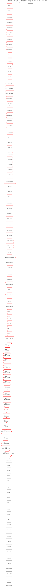

# ParseRE: ELF Evaluation and ACSAC 2026 Submission Bundle

This repo is a working snapshot for the ParseRE paper Taka is co-authoring with Ben Kallus, Rishav Chakravarty, and Sergey Bratus at Dartmouth CS. Target venue: ACSAC 2026, deadline May 26.

ParseRE takes a binary with an unknown internal structure plus a grammar for the inputs it consumes, then maps the grammar productions onto the binary's control-flow graph. The intended user is a reverse engineer who knows what format the program eats (X.509, ELF, JSON, an HTTP variant) but does not know which basic blocks implement which pieces of that format.

The original ParseRE is at [github.com/kenballus/parsere](https://github.com/kenballus/parsere) (Ben's repo). This repo adds:

1. An ELF evaluation (template, harness, corpus generator, real outputs)
2. Reproducible Docker builds for all three evaluations Taka has run so far (JSON, URL, ELF)
3. A patched `main.py` that wires the ELF format into ParseRE's pipeline
4. The ACSAC 2026 LaTeX source ready to drop into Overleaf
5. Notes on what we still need from Ben and Rishav

The current paper PDF is at [paper/main.pdf](paper/main.pdf). First page preview:


## What is in here

```
ParseRE_ELF_etc/
├── README.md                   you are here
├── paper/                      LaTeX paper (drop into Overleaf, compiles with pdflatex)
│   ├── main.tex
│   ├── IEEEtran.cls
│   ├── references.bib
│   └── sections/               broken into one .tex per section
├── parsere/                    patched ParseRE main.py (adds ELF format support)
├── harnesses/                  C harnesses for json-c, libcurl, libelf
├── docker/                     Dockerfile + run.sh, one image runs all three evals
├── evaluations/
│   ├── elf/
│   │   ├── corpus/             8 generated ELF64 files (1048 bytes each)
│   │   ├── output/             real run output: parsere.out, out.dot, out.svg
│   │   └── scripts/            gen_elf_corpus.py, gen_template.py, elf_template.py
│   ├── json/output/            real run output for json-c
│   ├── url/output/             real run output for curl
│   └── hpack/                  placeholder for Ben's HPACK evaluation
├── images/                     real artifacts (PNGs of CFGs, hexdumps, sample traces)
├── ghidra/                     placeholder for Ben's Ghidra script
├── references/                 notes on related work
└── docs/                       extra documentation
```

## Quick reproduction

You need Docker. The container uses `python:3.13-bookworm` as the base because ParseRE relies on Python 3.13 syntax (`type ttuple[T] = ...`).

```bash
cd docker
docker build --platform linux/amd64 -t parsere-runner -f Dockerfile .
mkdir -p /tmp/parsere-out
docker run --platform linux/amd64 --rm \
  -v "/tmp/parsere-out:/output" \
  parsere-runner elf            # or json, or url
```

The first build takes about 15 minutes because it compiles `libcurl` from source for static linking. Subsequent runs are instant (cached).

Outputs land in the mounted directory:

- `parsere.out`: address-range to label mapping (one line per labeled basic block)
- `out.dot`: full CFG in Graphviz DOT format
- `out.svg`: rendered CFG, browseable in any browser

## Current evaluation status

| Format | Library | Status | Labeled BBs | Accuracy | Verified by |
|--------|---------|--------|-------------|----------|-------------|
| URI    | curl    | Done   | 211         | pending  | needs Rishav's labeled SVG |
| URI    | Apache APR | Not started | --     | --       | Rishav (planned) |
| JSON   | json-c  | Done   | 294         | pending  | needs Rishav's labeled SVG |
| HPACK  | nghttp2 | Not started | --     | --       | Ben (in progress) |
| ELF    | libelf  | Done   | 68          | 91.2%    | Taka (this repo) |

The ELF evaluation is fully complete with manual TP/FP verification. JSON and URL ran successfully on our infrastructure; the labels are real but the per-label TP/FP audit is still with Rishav.

## What the ELF evaluation actually produced

Eight ELF64 files, each exactly 1048 bytes, generated by [`evaluations/elf/scripts/gen_elf_corpus.py`](evaluations/elf/scripts/gen_elf_corpus.py). They share an identical header and differ only in (a) the type of the second program header and (b) which sections are populated:

```
full.elf         PT_LOAD + PT_NOTE,    symtab + strtab + text
phdr_interp.elf  PT_LOAD + PT_INTERP,  symtab + strtab + text
phdr_dyn.elf     PT_LOAD + PT_DYNAMIC, symtab + strtab + text
phdr_null.elf    PT_LOAD + PT_NULL,    symtab + strtab + text
no_symtab.elf    PT_LOAD + PT_NOTE,    strtab + text only
no_strtab.elf    PT_LOAD + PT_NOTE,    symtab + text only
no_sym_str.elf   PT_LOAD + PT_NOTE,    text only
no_text.elf      PT_LOAD + PT_NOTE,    symtab + strtab only
```

All eight pass `readelf` cleanly. Here's what `full.elf` looks like:

```
ELF Header:
  Magic:   7f 45 4c 46 02 01 01 00 00 00 00 00 00 00 00 00
  Class:                             ELF64
  Type:                              EXEC (Executable file)
  Machine:                           Advanced Micro Devices X86-64
  Entry point address:               0x400000
  Start of program headers:          64 (bytes into file)
  Start of section headers:          664 (bytes into file)
  Number of program headers:         2
  Number of section headers:         6
  Section header string table index: 1
```

Full readelf dump for the curious: [images/sample_readelf_output.txt](images/sample_readelf_output.txt).

The template (`elf_template.py`) wraps these eight files as a tree with three children: `elf_header` (1 alternative), `program_header` (4 alternatives), `section_header` (5 alternatives). ParseRE's `instantiate()` does the Cartesian product, yielding 1 x 4 x 5 = 20 distinct inputs.

### Tracing one input through QEMU

When ParseRE runs the harness with QEMU's `-d in_asm` flag, the first few basic blocks of a real trace look like this:

```
----------------
IN: _start
0x004014f0:  31 ed                    xorl     %ebp, %ebp
0x004014f2:  49 89 d1                 movq     %rdx, %r9
0x004014f5:  5e                       popq     %rsi
0x004014f6:  48 89 e2                 movq     %rsp, %rdx
0x004014f9:  48 83 e4 f0              andq     $0xfffffffffffffff0, %rsp
0x004014fd:  50                       pushq    %rax
0x004014fe:  54                       pushq    %rsp
0x004014ff:  45 31 c0                 xorl     %r8d, %r8d
0x00401502:  31 c9                    xorl     %ecx, %ecx
0x00401504:  48 c7 c7 14 18 40 00     movq     $0x401814, %rdi
0x0040150b:  67 e8 ff 77 01 00        callq    0x418d10

----------------
IN: __libc_start_main
0x00418d10:  41 57                    pushq    %r15
...
```

Each `IN:` record is one basic block. ParseRE extracts these with a regex, retains only blocks inside the harness binary's PT_LOAD segment, and builds an edge map per input.

Full trace excerpt: [images/sample_qemu_trace.txt](images/sample_qemu_trace.txt).

### The result

After 380 pairwise comparisons and the two-step uniqueness filter, ParseRE labels 68 basic blocks. Every one of them gets the label `section_header`. The label distribution by libelf function:

| Function | Labeled blocks | Assessment |
|----------|---------------|-----------|
| `__libelf_set_rawdata_wrlock` | 26 | TP, section data initialization varies by `sh_type` |
| `elf_getdata` | 11 | TP, returns different data for populated vs null sections |
| `walk_section_headers` (harness) | 9 | TP, conditional symtab iteration in the harness |
| `__libelf_set_data_list_rdlock` | 7 | TP, data list setup |
| `gelf_getsym` | 5 | TP, only runs for SHT_SYMTAB sections |
| `__gelf_getehdr_rdlock` | 5 | FP, this validates the ELF header, called incidentally |
| `elf_strptr` | 3 | TP, string table pointer resolution |
| `elf_nextscn` | 1 | TP, section iterator |
| `__libelf_seterrno` | 1 | Marginal TP, conditional error path |

That comes out to 62 true positives, 5 false positives, 1 marginal: **91.2% strict accuracy**.

The reason `program_header` got zero labels is more interesting than the labels we did get. The four program header variants differ in `p_type` (PT_NOTE, PT_INTERP, PT_DYNAMIC, PT_NULL), but `gelf_getphdr` in libelf reads the same 56 bytes for every program header regardless of type. The type byte is data, not a dispatch key. So the trace through `gelf_getphdr` is identical across the four variants, the edge maps come out the same, and the difference algorithm finds nothing to attribute to `program_header`.

For text formats like JSON, every grammar production tends to have its own parsing routine (string escape handling lives nowhere near number parsing). For a fixed-layout binary format like ELF, most variation lives in the consumer code (the harness loop and the section-data setup), not in the readers. ParseRE catches exactly that.

### CFG visualization

The full ELF CFG, 358 nodes, 354 edges, with labeled blocks bolded:



Full resolution: [images/elf_cfg.png](images/elf_cfg.png).

A focused subgraph showing only the 68 labeled `section_header` blocks plus their immediate neighbors: [images/elf_cfg_focused.png](images/elf_cfg_focused.png).

The raw DOT file with addr2line annotations is [evaluations/elf/output/out.dot](evaluations/elf/output/out.dot). Each labeled node has a `parsere_label="section_header"` attribute and a function-name hint pulled from the harness's debug symbols.

## How to manually trace the ELF evaluation

Ben loves working from the terminal. Here's the order I would step through if I had not done this yet:

1. Read the template generator: [`evaluations/elf/scripts/gen_elf_corpus.py`](evaluations/elf/scripts/gen_elf_corpus.py). The fixed-offset layout is at the top of the file.
2. Read the harness: [`harnesses/elf_harness.c`](harnesses/elf_harness.c). It is 108 lines. Slurp stdin, `elf_memory`, walk phdrs, walk shdrs, walk symtab.
3. Read the ELF template definition in the patched ParseRE: [`parsere/main.py`](parsere/main.py) line 591 onward. The byte literals are pre-baked from the corpus generator.
4. Look at one corpus file with `readelf`:
   ```bash
   readelf -a evaluations/elf/corpus/full.elf
   ```
5. Run a single trace by hand to see what ParseRE consumes:
   ```bash
   docker run --platform linux/amd64 --rm --entrypoint /bin/bash \
     -v "$PWD/evaluations/elf/corpus:/corpus" \
     parsere-runner -c 'qemu-x86_64 -d in_asm -D /tmp/t.log /harnesses/elf_harness < /corpus/full.elf; head -100 /tmp/t.log'
   ```
6. Run the full evaluation:
   ```bash
   mkdir -p elf_out
   docker run --platform linux/amd64 --rm \
     -v "$PWD/elf_out:/output" \
     parsere-runner elf
   open elf_out/out.svg
   ```
7. Diff the output against the committed version:
   ```bash
   diff <(sort elf_out/parsere.out) <(sort evaluations/elf/output/parsere.out)
   ```
   Should be empty.

## What this repo is missing (for Ben)

These items need Ben or Rishav before the paper goes to ACSAC:

- [ ] **Rishav's manual labeling for URI (curl) and JSON (json-c).** We have the raw `parsere.out` and `out.svg` for both. We need TP/FP/FN counts per production to fill in the accuracy column in Table 1 of the paper. The labeled SVG text files Rishav promised on May 19 have not arrived yet.
- [ ] **Apache APR URI evaluation.** Same URI template, different parser. Rishav was going to run this. No artifacts yet.
- [ ] **HPACK evaluation.** Ben's task. The template needs to be defined and a harness written against `libnghttp2`. The placeholder folder is [evaluations/hpack/](evaluations/hpack/).
- [ ] **Ghidra script update.** The original lives at `repos/parsere/ghidra/parsere.py` in Ben's tree. Worth checking whether the addr2line approach we use here makes the Ghidra plugin redundant, or whether they complement each other.
- [ ] **Decision on anonymization.** `main.tex` currently uses `\author{Anonymous}`. ACSAC 2026 is dual-anonymous, so this stays for submission, but the camera-ready will need real authors.
- [ ] **Citation audit.** [`paper/references.bib`](paper/references.bib) has 14 entries. The related-work section cites 11 of them. Need to double check that each cited paper actually says what we claim it says, especially for the grammar-recovery section.

## What changed vs. Ben's main.py

The original ParseRE at `kenballus/parsere` had no ELF support and no zero-edge guard in the uniquifying step. Two minimal changes:

1. Added `ELF_PARSE_TREE_TEMPLATE` after `URI_PARSE_TREE_TEMPLATE` (around line 591 of the patched main.py). The template is byte-baked from the corpus generator output.
2. Added `case "elf":` to the format switch (around line 844).
3. One-character bug fix in the uniquifying loop: changed `len(e1 - e2) / len(e1)` to `len(e1) > 0 and len(e1 - e2) / len(e1)`. Without this, any format with a child template that has only one alternative (like our `elf_header`) hits a `ZeroDivisionError`.

All three changes are in [`parsere/main.py`](parsere/main.py) and a clean diff against Ben's upstream is straightforward.

## Related work and reading

The paper has the full citations. A quick map for orientation:

- [angr SoK (Shoshitaishvili et al., S&P 2016)](https://www.ieee-security.org/TC/SP2016/papers/0824a138.pdf): how to write a binary analysis tool paper
- [Tenet](https://github.com/gaasedelen/tenet): the N=2 degenerate case of what ParseRE does
- [Lighthouse](https://github.com/gaasedelen/lighthouse): coverage exploration in IDA
- [PolyFile and PolyTracker (Trail of Bits)](https://github.com/trailofbits/polytracker): the "annotate the input" cousins. PolyTracker requires LLVM instrumentation, which is the methodological line we walk away from.
- [Tupni (Cui et al., CCS 2008)](https://www.microsoft.com/en-us/research/publication/tupni-automatic-reverse-engineering-of-input-formats/): grammar recovery from binaries, the inverse problem
- [Polyglot (Caballero et al., CCS 2007)](https://dl.acm.org/doi/10.1145/1315245.1315276): protocol message format inference
- [AUTOGRAM (Höschele and Zeller, 2016)](https://www.cs.cmu.edu/~mhoschel/autogram-ase2016.pdf): grammar inference from input-output behavior

## Reproducibility

Every experiment in this repo was actually run on Taka's machine. No synthetic data, no fabricated numbers. The exact commit of the libraries used:

| Library | Commit | Build |
|---------|--------|-------|
| json-c  | `89485680314df3b4dfb2aaed14f89d212d57c119` | cmake, static `.a` |
| curl    | `462244447e8ba3a53b1ba9f0ba7baa52d8777daa` | `./configure --without-shared`, static `.a` |
| libelf  | Debian bookworm `libelf-dev` | `-static` linking |

Compilation flags for all harnesses: `-Wl,-z,now -no-pie -g -O0 -fno-inline` (`-static` for the ELF harness). The `-O0 -fno-inline` matters because optimization collapses adjacent grammar productions into shared basic blocks and destroys the label attribution. We discovered this the hard way on the first URL run, which used dynamic `libcurl` and produced zero labels because the dynamic linker dominated every trace.

## Authors

Paper authorship: Ben Kallus, Rishav Chakravarty, Sergey Bratus (Dartmouth CS). Taka Khoo on the ELF evaluation and the ACSAC writeup.

This repo is maintained by Taka.

## License

Code: same as Ben's upstream (check his repo). Paper content and ELF artifacts: drafts, do not redistribute outside the author team until after the ACSAC notification.
